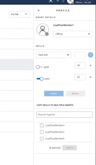

# Twilio Flex Plugin - Worker Skills Management

Twilio Flex Plugins allow you to customize the appearance and behavior of [Twilio Flex](https://www.twilio.com/flex). If you want to learn more about the capabilities and how to use the API, check out our [Flex documentation](https://www.twilio.com/docs/flex).

This plugin replaces the native flex [WorkerSkills](https://www.twilio.com/docs/flex/developer/ui/components#workerskills) component, adds audit feature (user who last updated a worker skills) and bulk skills management functionality. Two new worker attributes `skillsUpdatedBy` and `skillsUpdatedTimestamp` are used track who last updated the worker skills. The bulk skills mamangement feature, allows a user a select a worker, and copy their skills to other workers in the same workspace.


<p align="center">

</p>

If you only want to grant a selected number of users (say users with specific roles e.g. admins) access/ability to edit worker skills, then you replace editable component with a Display only component.

<p align="center">

</p>


## Setup

Make sure you have [Node.js](https://nodejs.org) as well as [`npm`](https://npmjs.com). We support Node >= 10.12 (and recommend the _even_ versions of Node). Afterwards, install the dependencies by running `npm install`:

```bash
cd 

# If you use npm
npm install
```

Next, please install the [Twilio CLI](https://www.twilio.com/docs/twilio-cli/quickstart) by running:

```bash
brew tap twilio/brew && brew install twilio
```

Finally, install the [Flex Plugin extension](https://github.com/twilio-labs/plugin-flex/tree/v1-beta) for the Twilio CLI:

```bash
twilio plugins:install @twilio-labs/plugin-flex
```

## Serverless Functions


### Deployment

Create the Serverless config file by copying `.env.example` to `.env`.

```bash
cd serverless
cp .env.example .env
```
Edit `.env` and set the `WORKSPACE_SID` (Twilio TaskRouter Workspace Sid),, `RETRY_COUNT` (number of times to retry when there is a conflict or error when updating worker attributes). Next, deploy the Serverless functions:

```bash
cd serverless
twilio serverless:deploy
```
After successfully deploying your function, you should see at least the following:
```bash
✔ Serverless project successfully deployed

Deployment Details
Domain: worker-skills-xxxx-dev.twil.io

Functions:
   https://worker-skills-xxxx-dev.twil.io/workers-bulk-skills-update
```

Your functions will now be present in the Twilio Functions Console and be part of the "worker-functions" service. Copy the base URL from the function.

## Flex Plugin

### Development

Create the plugin config file by copying `.env.example` to `.env`.

```bash
cd plugin-worker-skills
cp .env.example .env
```

Edit `.env`, set the `FLEX_APP_FUNCTIONS_BASE` variable to your Twilio Functions base URL (like https://worker-skills-xxxx-dev.twil.io), `BULKSKILLS_BATCH_SIZE` to batch size for bulk worker skills update . 

Run `twilio flex:plugins --help` to see all the commands we currently support. For further details on Flex Plugins refer to our documentation on the [Twilio Docs](https://www.twilio.com/docs/flex/developer/plugins/cli) page.

<video width="320" height="240" controls>
  <source src="/screen_captures/bulk-skills.mp4" type="video/mp4">
</video>